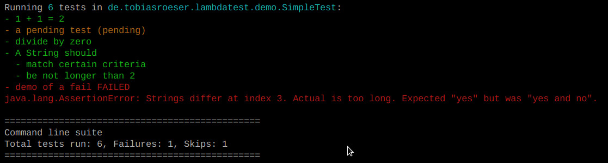

= Lambda Test
:toc:
:toc-placement: preamble
:lambdatestversion: 0.3.0
:documentationversion: 0.3.1-SNAPSHOT
:testngversion: 6.11
:junitversion: 4.12
:lambdatest: LambdaTest

image:https://travis-ci.org/lefou/LambdaTest.svg?branch=master["Build Status", link="https://travis-ci.org/lefou/LambdaTest"]
image:https://api.codacy.com/project/badge/Grade/e886bd7ca9784ecfb00fe8afb59b8909["Codacy code quality", link="https://www.codacy.com/app/lefou/LambdaTest"]
image:https://badges.gitter.im/lefou/LambdaTest.svg["Chat on Gitter", link="https://gitter.im/lefou/LambdaTest"]

Lambda-enabled functional testing on top of JUnit and TestNG.

Documentation for LambdaTest {documentationversion}.

== Motivation

When constrained to work in a Java-only toolchain, I really miss my http://scalatest.org[ScalaTest].
I tried some lambda enabled test frameworks, but until now, did not find a suitable solution without compromizing the integration benefits.

Thus I decided to write a small and generic test library that allows writing of functional test without reinventing the wheel.
LambdaTest works on top of JUnit and TestNG, all you need is to add it to the test classpath.
No further adaptions to your existing test setup are needed.
You will immediately gain the joy of Lambda-enabled functional testing, better assertion messages and nicely colored output.

== Features

Most important features are:

* Write test via API (No longer required to have each test in a separate annotated method)
* Meaningful names for tests
* Nicely colored output per test case
* Easy to write data-centric tests (e.g. generate as much test cases as you need programmatically, e.g. in a loop)
* Easy to intercept exceptions with `intercept`
* Useful assertion message and difference highlighting in `expectXXX`-methods
* Opt-in to not fail fast when using `expectXXX`-methods (see more than the first assertion error)
* Easy to mark pending tests
* Contains useful tools to work with temporary files and directories

== Download from Maven Central

{lambdatest} is available from http://search.maven.org/#search%7Cgav%7C1%7Cg%3A%22de.tototec%22%20AND%20a%3A%22de.tobiasroeser.lambdatest%22[Maven central repository].

Maven users can use the following dependency declaration:

[source,xml,subs="attributes,verbatim"]
----
<dependencies>
  <dependency>
    <groupId>de.tototec</groupId>
    <artifactId>de.tobiasroeser.lambdatest</artifactId>
    <version>{lambdatestversion}</version>
    <scope>test</scope>
  </dependency>
  <!-- If you use LambdaTest with JUnit -->
  <dependency>
    <groupId>junit</groupId>
    <artifactId>junit</artifactId>
    <version>{junitversion}</version>
    <scope>test</scope>
  </dependency>
  <!-- If you use LambdaTest with TestNG -->
  <dependency>
    <groupId>org.testng</groupId>
    <artifactId>testng</artifactId>
    <version>{testngversion}</version>
    <scope>test</scope>
  </dependency>
</dependencies>
----

http://sbuild.org[SBuild] users can use the following dependencies:

.Use with JUnit
[source,scala,subs="attributes"]
----
"mvn:de.tototec:de.tobiasroeser.lambdatest:{lambdatestversion}" ~
  "mvn:junit:junit:{junitversion}"
----

.Use with TestNG
[source,scala,subs="attributes"]
----
"mvn:de.tototec:de.tobiasroeser.lambdatest:{lambdatestversion}" ~
  "mvn:org.testng:testng:{testngversion}"
----

== Choose your favorite Unit-Test Runner: JUnit or TestNG

With {lambdatest}, you need to only know LambdaTests very simple and minimalistic API but can use it to write test for JUnit and TestNG.

To avoid a dependency to both frameworks at the same time, your test class  inherits a different base class, but besides that, everything else is the same.

For JUnit you inherit `de.tobiasroeser.lambdatest.`*`junit`*`.FreeSpec`.

For TestNG you inherit `de.tobiasroeser.lambdatest.`*`testng`*`.FreeSpec`.

== Writing tests with Lambda Test

Here you see a basic test example, which produces a valid TestNG test class.
You need to extend from class `de.tobiasroeser.lambdatest.testng.FreeSpec`.

[source,java]
----
import static de.tobiasroeser.lambdatest.Expect.expectEquals;
// You can also use JUnit based tests with
// import de.tobiasroeser.lambdatest.junit.FreeSpec;
import de.tobiasroeser.lambdatest.testng.FreeSpec;

public class SimpleTest extends FreeSpec {
  public SimpleTest() {

    test("1 + 1 = 2", () -> {
      expectEquals(1 + 1, 2);
    });

    test("a pending test", () -> pending());

    test("divide by zero", () -> {
      int a = 2;
      int b = 0;
      intercept(ArithmeticException.class, () -> {
        int c = a / b;
      });
    });

    section("A String should", () -> {
      final String aString = "A string";

      test("match certain criteria", () -> {
        expectString(aString)
          .contains("string")
          .containsIgnoreCase("String")
          .startsWith("A")
          .endsWith("ng")
          .hasLength(8);
      });

      test("be not longer than 2", () -> {
        expectString(aString).isLongerThan(2);
      });
    });

    test("demo of a fail", () -> {
      "yes".equals("yes and no");
    });
  }
}
----

The methods `test`, `pending` and `intercept` are provided by `FreeSpec`
whereas the usual `expectXXX` methods are provided by `Expect`.

The output of this test suite above would look like this:

[NOTE]
--
You can run the above test directly in the {lambdatest} project directory with:

----
mvn test -Dtest=SimpleTest
----
--

You should write your test cases so that they don't need to be executed in order.
{lambdatest} is able to run tests in parallel, if you enable it explicitly with `FreeSpec.setRunInParallel(true)`.

By default `expectXXX`-methods fail fast, which means the first failing assertion will end the whole test.
This is also the behaviour you will get with most other test frameworks.

But you can disable fail-fast behaviour for assertions/expectations with `FreeSpec.setExpectFailFast(false)`.
Then, the first failing `expectXXX`-error will not abort the test but the test is optimistically continued.
Further failing assertion errors are collected and the test fails at the end, reporting all collected errors.

== Writing assertions with `Expect`

{lambdatest} provides many methods in the class `de.tobiasroeser.lambdatest.Expect` to write assertion.
You can use these as an alternative to the assertion methods provides by other unit testing framework to gain the following advantages:

* Nice output of differences between expected and actual values. Especially for string and various collection types
* `expectXXX`-methods provide a feature to collect multiple assertions (non-fail-fast behaviour), such that you can collect as much errors as possible in one test run, instead of giving up at the first error.

.Selected static methods of `Expect`
* `expectNull` - Assert that a given value is null
* `expectNotNull` - Assert that a given value is not null
* `expectEquals` - Assert equality of two given objects or values.
* `expectNotEquals` - Assert non-equality of two given objects or values.
* `expectTrue` - Assert a value evaluates to `true`
* `expectFalse` - Assert a value evaluates to `false`
* `expectString` - Assert that a given string is non-null and return an instance of `ExpectString` with provides furter checks on the actual string in a fluent API
* `intercept` - Assert that a code block throws an Exception of the given type and optional with an message matching a given regular expression. Returns the thrown exception for further analysis

There are more method in `Expect` with setup and control it non-fail-fast handling via ThreadLocals. Those are only needed, if you want to use these behaviour outside of `FreeSpec`.

[NOTE]
--
If you want to use the non-fail-fast behaviour of the `Expect` class  outside of `FreeSpec`, you have to take care of setup and finalization by yourself.
--

== Fluent String analysis with `ExpectString`

To inspect and assert string, use the class `ExpectString`, which is also returned, if you use `Expect.expectString`.

.Methods of `ExpectString`
* `isEqual`
* `isNotEqual`
* `isEqualIgnoreCase`
* `isNotEqualIgnoreCase`
* `startsWith`
* `StartsWithNot`
* `endsWith`
* `endsNotWith`
* `matches`
* `matchesNot`
* `hasLength`
* `hasLengthNot`
* `isLongerThan`
* `isShorterThan`
* `isTrimmed`
* `contains`
* `containsNot`
* `containsIgnoreCase`
* `containsIgnoreCaseNot`

== Testing files and directories with `TempFile`

{lambdatest} comes with a helper class `de.tobiasroeser.lambdatest.TempFile` with contains useful methods to work with temporary files.

To create a temporary file with a given content and do something with it, you can use `TempFile.withTempFile` or it procedural version with does not return a value `TempFile.withTempFileP`. After the method completes, the temporary file will automatically deleted.

To create and work with temporary files, you can use `TempFile.withTempDir` and TempFile.withTempDirP`. Those will be recursively deleted after completion.

There are more useful methods in class `TempFile`, e.g. `readFile`, `writeToFile` and `deleteRecursive`. Please inspect the class for more information.

== Working on Java7 or below

Even though writing functional test makes most sence under Java 8,
there are enough reasons to also use them on older Java versions which do not provide nice closures.

{lambdatest} does not use any Java 8 API!
Therefore, there is nothing that stops you. You can download pre-compiled binaries of LambdaTest for older Java Runtimes down to Java 6.
To use the non-Java8 version with Maven, use a classifier ("java7", or "java6") to download the version you want.
The compatibility packages are produced with the great https://github.com/orfjackal/retrolambda[retrolambda project].

To use the Java7 version in Maven:

[source,xml,subs="attributes,verbatim"]
----
<dependencies>
  <dependency>
    <groupId>de.tototec</groupId>
    <artifactId>de.tobiasroeser.lambdatest</artifactId>
    <version>{lambdatestversion}</version>
    <classifier>java7</classifier>
    <scope>test</scope>
  </dependency>
  <!-- Also you need one of JUnit or TestNG, see above -->
</dependencies>
----

or in SBuild:

[source,scala,subs="attributes"]
----
"mvn:de.tototoec:de.tobiasroeser.lambdatest:{lambdatestversion};classifier=java7"
----

Instead of Java 8 Closures, you have to create anonymous classes.

[source,java]
----
import static de.tobiasroeser.lambdatest.Expect.expectEquals;
import de.tobiasroeser.lambdatest.RunnableWithException;
import de.tobiasroeser.lambdatest.junit.FreeSpec;

class SimpleTest extends FreeSpec {
  public SimpleTest() {

    test("1 + 1 = 2", new RunnableWithException() {
      public void run() throws Exception {
        expectEquals(1 + 1, 2);
      }
    });

    test("divide by zero", new RunnableWithException() {
      public void run() throws Exception {
        int a = 2;
        int b = 0;
        intercept(ArithmeticException.class, new RunnableWithException() {
          public void run() throws Exception {
            int c = a / b;
          }
        });
      }
    });
  }
}
----

== Build {lambdatest} from Source

=== Building with Maven

{lambdatest} is build with https://maven.apache.org[Apache Maven 3.3.1] and the https://github.com/takari/polyglot-maven#overview[polyglot-scala extension]. Maven 3.5 is recommended.

.Build LambdaTest from source
----
mvn clean install
----

The built JARs file can be found in the `target` directory.

=== Create `pom.xml` for interoperability, e.g. IDEs

To generate the `pom.xml` use the `gen-pom-xml` profile.

.Creating `pom.xml` files
----
mvn -Pgen-pom-xml initialize
----

.Deleting generated `pom.xml` files
----
mvn -Pgen-pom-xml clean
----

== Licence

This project is published under the http://www.apache.org/licenses/LICENSE-2.0.txt[Apache Licence Version 2.0].

== Contribution / Contact

Your feedback is highly appreciated. I also accept pull request.

For questions please use the https://gitter.im/lefou/LambdaTest[Gitter chatroom].
To report issues or send pull request, use https://github.com/lefou/LambdaTest[GitHub].

You can also find me on https://twitter.com/TobiasRoeser[Twitter as @TobiasRoeser].

If you like {lambdatest}, please star it on https://github.com/lefou/LambdaTest[GitHub]. This will help me to set my priorities. Thanks!

== Changelog

=== LambdaTest NEXT

* `DefaultReporter` can now hide the stacktrace
* Improved `expectEquals` message for number and arguments of different types
* Fixed inverted `expectNotNull` behaviour
* Extended test suite

=== LambdaTest 0.3.0 - 2017-10-30

* Introduced `Reporter` interface and `DefaultReporter` class
* Introduced generic base class `FreeSpecBase` to hold test framework unspecific logic
* Added `FreeSpec.section` to allow more structured tests
* Reformatted output of tests (handled now by `Reporter`)
* Added `Assert.assertNull` and `Assert.assertNotNull`
* Added `Expect.expectNull` and `Expect.expectNotNull`
* Generate proper OSGi manifests for all JARs/bundles
* Fixed assert message of `Intercept.intercept(Class<T>, String, RunnableWithException)`
* Documentation improvements

=== LambdaTest 0.2.4 - 2016-08-03

* Added a pending method with a reason parameter.
* Added more JavaDoc comments.

=== LambdaTest 0.2.3 - 2016-05-10

* Fixed fail late logic for Expect
* Added new class ExpectString and Expect.expectString for fluent string assertions.

=== LambdaTest 0.2.2 - 2016-05-03

* Fixed Assert.assertEquals for Strings, especially when expected is empty or shorter than actual.

=== LambdaTest 0.2.1 - 2016-03-04

* Added `TempFile`, an utility class providing support to work with temporary files and directories which will be automatically cleaned up after the test case.

=== LambdaTest 0.2.0 - 2016-02-12

* Added JUnit support.
  You can now use `de.tobiasroeser.lambdatest.junit.FreeSpec` for JUnit based tests in addition to the already existing  `de.tobiasroeser.lambdatest.testng.FreeSpec` for TestNG based tests.
* Introduced new `Assert` and `Expect` classes. Expect-based asserts also support deferred exceptions. FreeSpec already integrates the setup of Expect.

=== LambdaTest 0.1.0 - 2014-12-08

* Also release compatibility packages for older Java runtimes: Java7 and Java6.
They are available via the "java7" and "java6" classifier.
* FreeSpec.intercept now returns the intercepted exception.
* Added FreeSpec.setRunInParallel to enable option to run tests in parallel.
* Introduced LambdaTest interface (implemented by testng.FreeSpec) to contain the common API.

=== Rerelease of LambdaTest 0.0.3 - 2014-11-29

* Rerelease of 0.0.3 under "de.tototec" groupId.
You can now grab it directly from Maven Central without configuring a dedicated bintray repository.

=== LambdaTest 0.0.3 - 2014-11-16

* Fixed issue with missapplied close of STDOUT stream
* Fixed bug preventing from TestNG seeing pending tests as skipped
* de.tobiasroeser.lambdatest.testng.FreeSpec class no longer inherits org.testng.Assert

=== LambdaTest 0.0.2 - 2014-10-18

* Colored output
* Added support to match exception messages with regex in intecept

=== LambdaTest 0.0.1 - 2014-10-15

* First release
